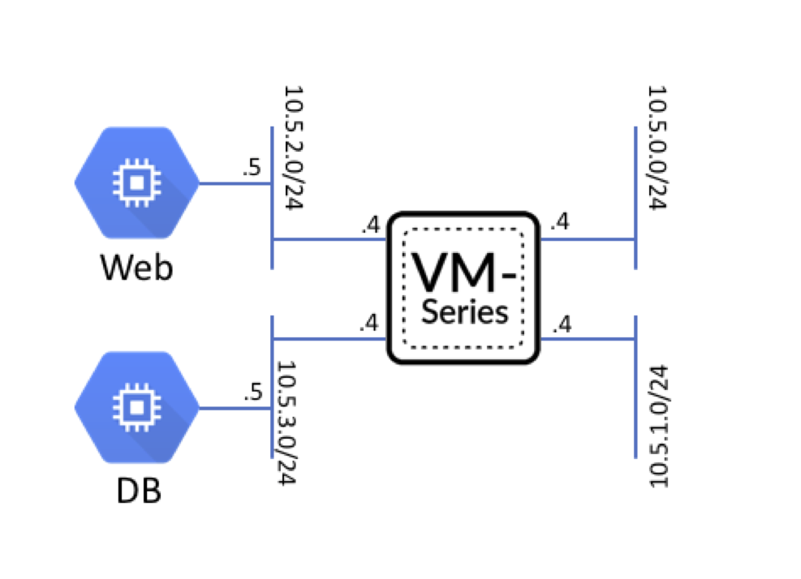

============
Introduction
============

Infrastructure as Code 
----------------------

This training lab provides hands-on exposure to Infrastructure as Code (IaC) 
concepts and practices.  IaC simply stated is the practice of defining, utilizing, 
and maintaining infrastructure definitions as one would application source code.

Config Definitions
    Infrastructure deployments and their configurations can be defined in various 
    languages.  Terraform provides an infrastructure definition language called HCL 
    that is multi-cloud in that it supports many different public and private cloud 
    environments.  Most IaC languages are declarative in nature.  This means 
    they define the desired state of the infrastructure rather than the steps 
    necessary to achieve that state.

Config Repository
    A version control system (VCS) is a key element in managing application source
    code.  Since infrastructure definitions are just another form of source code, 
    a VCS is a key element of IaC environemts as well.  It supports revision 
    control, code checkout/checkin, team collaboration, code review, and API hooks 
    for automated build tools.

Build Tools
    Build tools act on the infrastructure definitions to build and configure the 
    infrastructure components.  Often, this build process is incorporated 
    into a larger Continuous Delivery (CD) pipeline with automated tests and gate 
    factors that govern the build process.

Platform APIs
    In order to automate the deployment and configuration of infrastructure elements 
    an API must be accessible to the build tool being used.  Cloud providers such as 
    AWS, GCP, and Azure all have various APIs supporting different infrastructure 
    components and services.  Third-party virtual appliances such as the VM-Series 
    virtual firewall also has an API that may be used for configuration purposes.  
    However, the use of a common infrastructure definition language and build tools 
    all but eliminates the need to interact directly with any of these APIs.

Deploy Infrastructure
    The build tool is responsible for processing the infrastructure definition and 
    leveraging the backend APIs and orchestrating the deployment the infrastructure 
    components.  Terraform accomplishes this by first assessing the state of each 
    infrastructure resource.  If nothing is instantiated, Terraform will take the 
    necessary steps to deploy the resource and configure it based on the parameters 
    that have been provided.  

Test and Validate
    A set of tests may be performed to ensure that the deployed infrastructure aligns
    with the definitions provided in the infrastructure code.  Since Terraform 
    maintains state files detailing the live environment, it is easy to run a 
    ``terraform plan`` command to identify and resolve and disparties.

Lab Topology
------------

The following diagram details the infrastructure topology associated with the web 
application we will be deploying.  The VM-Series firewall will be used to inspect 
and protect "North-South" traffic between the ``untrust`` and ``web`` zones as well 
as "East-West" traffic between the ``web`` and ``database`` zones.

+--------------+--------------+-------------+
| Subnet       | Address      | Interface   |
+==============+==============+=============+
| Management   | 10.5.0.0/24  | Management  |
+--------------+--------------+-------------+
| Untrust      | 10.5.1.0/24  | ethernet1/1 |
+--------------+--------------+-------------+
| Web          | 10.5.2.0/24  | ethernet1/2 |
+--------------+--------------+-------------+
| Database     | 10.5.3.0/24  | ethernet1/3 |
+--------------+--------------+-------------+

Lab Components
--------------

Qwiklabs
    This lab is launched using Qwiklabs, which is an online learning platform
    that deploys and provides access to cloud-based lab environments.  Qwiklabs
    will establish a set of temporary set of credentials in the cloud provider
    in order to deploy and access the cloud infrastructure and services.

Google Cloud Platform (GCP)
    Google Cloud Platform, offered by Google, is a suite of cloud computing
    services that runs on the same infrastructure that Google uses internally
    for its end-user products, such as Google Search and YouTube.

Panorama
    Panorama is the centralized management and reporting platform for PAN-OS 
    devices including firewall appliances, VM-Series virtual firewalls, 
    WildFire appliances, and log collectors.  It serves as the configuration 
    "source of truth" for a PAN-OS infrastructure deployment and supports the 
    same XML and REST APIs as other PAN-OS devices.

Hashicorp Terraform
    Each cloud provider offers a mechanism that allow you to define a set of
    infrastructure element or services and orchestrate their instantiation.
    However, these tools and templates are specific to each cloud provider.
    We will be using Terraform to perform this function as it provides a
    common set of capabilities and a template formats acroos all cloud
    providers.